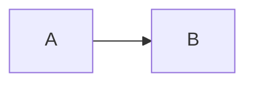

# Writing content for a Deckhouse product site

This file describes what the theme offers to authors of a product documentation site:
content layout, page parameters, shortcodes, render hooks and known pitfalls.
It is the contract between the theme and the content.
The Claude Code plugin `deckhouse-product-site` reads this file from the `main` branch,
so keep it in sync with `layouts/` in the same pull request that changes them.

Editorial rules (style, terminology, EN/RU parity) are not part of the theme.
They are published at <https://pp.flant.ru/llms.txt> and in the `deckhouse-writing` plugin.

## Content layout

- Documentation pages are in `content/documentation/`.
- The language is set by the file name: `page.md` is English, `page.ru.md` is Russian.
  Localised images and other resources follow the same rule: `scheme.png` and `scheme.ru.png`.
- File names are lowercase kebab-case.
- A section is a directory with `_index.md` and `_index.ru.md`.
  Its sidebar entry is not clickable, so keep `_index` files to front matter only and put the content into leaf pages, for example `overview.md`.
- The sidebar order is set by `weight`.

## Page parameters

### Common parameters

| Parameter | Purpose |
| --- | --- |
| `title` | Page title, rendered as the page heading. Do not add a first-level heading to the body |
| `description` | Short summary for search engines, page lists and AI exports |
| `weight` | Position in the sidebar |
| `params.relatedLinks` | Related pages rendered as a block at the end of the page |
| `params.edition` | Edition badge in the sidebar |

Quote values that contain a colon. An invalid front matter value fails the build of the whole site.

### Related links

Do not write a "Related links" section in the page body; list the pages in front matter:

```yaml
params:
  relatedLinks:
    - title: "Link"
      url: link.html
    - title: "External link"
      url: "http://domain/external/link.html"
    - url: /modules/monitoring-kubernetes/
```

An item without `title` is allowed for module links such as `/modules/<module-name>/`.

### Edition badge

Set `params.edition` to mark a page as available in a specific edition.
Edition codes are defined in `data/editions.yaml`: `ee`, `se`, `be`, `fe`, `cse` by default.

```yaml
---
title: "Enterprise-only feature"
params:
  edition: ee
---
```

To mark a whole section, set it once in `_index.md` with `cascade`; a child page can override it:

```yaml
---
title: "Enterprise features"
weight: 40
cascade:
  params:
    edition: ee
---
```

### Section index of the documentation

The `documentation/_index.md` and `_index.ru.md` pages enable site-wide outputs:
`search` for offline search, `markdown`, `llms` and `corpus` for AI exports, `print` for PDF and DOCX exports.
Change them only together with the site configuration; see `README.md`.

## Shortcodes

Use only the shortcodes below, with their exact parameters. Liquid tags (``) do not work.
Prefer the `` form: the shortcodes render the Markdown inside them themselves,
and this form is exported correctly to the AI and print outputs.

### Alert

```go-html-template

Text of the warning.

```

Levels: `info` (default), `warning`, `danger`.

### Details

A collapsible block for long optional content:

```go-html-template

Markdown content.

```

The title is the named `summary` parameter. Without it, the block is titled "Details".
The syntax matches the built-in Hugo `details` shortcode, but the theme replaces it with its own:
only `summary` is supported; the other built-in parameters (`open`, `name`, `class`, `title`) are ignored.

### Tabs

Alternative ways to do the same task:

```go-html-template


Markdown content.


Markdown content.


```

The two `name` parameters mean different things:

- `name` of `tabs` is the identifier of the tab set. The element IDs of the tabs and the key of the remembered choice are built from it.
  It is optional, but set it, unique on the page and meaningful, for example `install_method`.
  Without it, the identifier is generated from the page path and the number of the tab set on the page,
  so it changes when a tab set is added above.
- `name` of `tab` is the caption of the tab. It is required.

Both can also be passed as the first positional parameter, `` and ``, but prefer `name=`.

Write tab sets in the `` form: `` and ``.
Do not write `{}` unless you need it for a specific reason:
Hugo renders its content to HTML itself, with the source indent, so content indented by 4 or more spaces
(for example, tabs nested in a list item inside another tab) becomes a code block, and the Markdown export flattens its code blocks to plain text.

Tab sets can be nested at any depth, including inside list items.
The `alert` and `details` shortcodes work inside a tab.
A link to an anchor inside a tab, for example to a heading, opens the tab and all the tabs around it.

The selected tab is remembered for the browser session by the tab set name and the tab caption,
and is opened again when the page is reloaded.
Tab sets with the same name on different pages share the choice when their captions match.

### Translate

`` inserts a string from `i18n/{en,ru}.yaml` of the theme or the site in the page language.

### Mermaid

A diagram from Mermaid source:

```go-html-template

flowchart LR
  A --> B

```

A fenced code block with the `mermaid` language renders the same way:

````markdown

````

### Downloads

`` renders links to the PDF and DOCX exports of the documentation.
It renders nothing unless `params.pdf` is enabled in the site configuration.
Use it on the documentation home page (`documentation/_index.md`).

## Render hooks

- **Links.** A relative link is looked up with `GetPage` relative to the directory of the page's source file,
  in the page body and inside the `alert`, `details` and `tab` shortcodes.
  If the path matches a page or a resource, the link is replaced with that page's URL;
  otherwise it is kept as written and the browser resolves it against the page URL.
  For example, `../overview/` in `admin/home/mapping.md` points to `admin/overview.md`, not to `admin/home/overview.md`.
  Check every relative link in the rendered page.
  A link to a heading on the same page is written as `#heading`.
- **GitHub-style alerts.** `> [!note]`, `> [!warning]` and `> [!caution]` blockquotes render as alerts
  of the levels `info`, `warning` and `danger`; other types render as `info`.
  They are supported for content such as OpenAPI descriptions; in pages, prefer the `alert` shortcode.
- **Code blocks.** Give every code block a language tag supported by Hugo (Chroma).
- **Headings and tables** render as Hugo does by default, except on the generated REST API pages.

## REST API reference

A site can have a REST API reference generated from an OpenAPI 3.0 spec. It is optional; the site setup is described in `README.md`.
If a site has it:

- a `content/<section>/_content.gotmpl` content adapter calls the `openapi/add-pages.html` partial;
- the pages are generated, one per tag, with English captions in every language and descriptions from the spec as is;
  do not create or edit them by hand;
- the spec in JSON is in `assets/`, for example `assets/openapi/rest.json`; it is never put into `data/`;
- regular pages of the section, such as `overview.md` and the `_index` files, are written by hand;
- changes to how the pages render go to this theme, not to the site.

## Local run and checks

The project template provides these `make` targets; run `make help` in the site for the current list:

| Target | Purpose |
| --- | --- |
| `make up` | Start the site with Docker Compose at `http://localhost` and `http://ru.localhost`; stops other containers on ports 80, 1313 and 1314 |
| `make down` | Stop the site |
| `make serve` | Hugo dev server without Docker Compose |
| `make build` | Build the site into `./public` |
| `make lint-markdown` | Markdown linter with `markdownlint.yaml`; `make lint-markdown-fix` fixes simple issues |

Known pitfalls:

- The development container can serve stale pages after some edits. Run `docker compose restart hugo` before concluding that a change did not apply.
- A page that fails to build can stop the whole site. Check the output of `make up` for Hugo errors.
